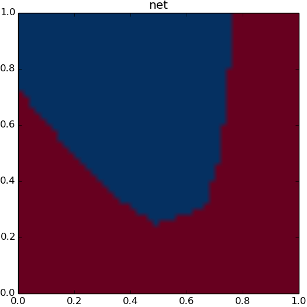
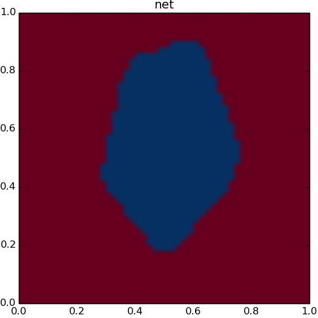
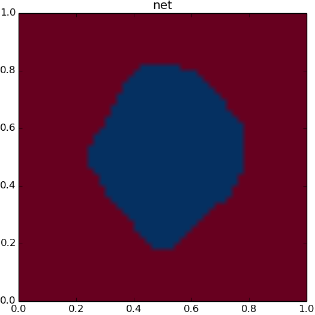
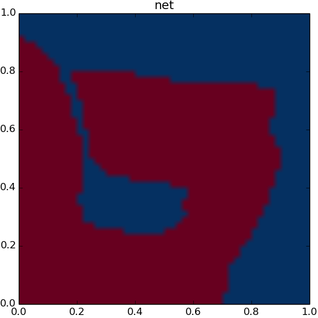
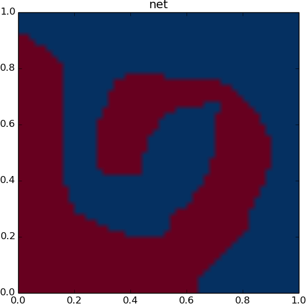
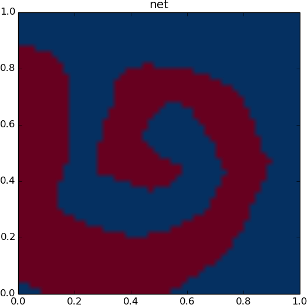

# Neural Networks

## Overview

My repository for creating and optimising neural networks. 

------

## MLP-1

### About
Dynamical generation of multilayered perceptron writting in python with numpi. First network I've created so was really just a test of whether I could apply the concepts, not very optimised yet.

### Design
- Dynamic network generator
- General forward and backwards propagation based on matrix multiplication
- RELU hidden node activaton
- Softmax output layer activation

### Technology

- python 3.7
- numpi for Maths
- sklearn for generating datasets
- Mamba & Expects for testing (TBC)

### How to Install
Ensure the following is installed on your system:
- python 3.7.6
- anaconda 2020.02
Then install sklearn from the command line using
```
pip install -U scikit-learn
```
Finally clone or download the repository and run the mlp file directly by running the following command from the root of the repository:
```
python ./mlp-1/lib/mlp_net.py
```

### Progress

Complete:
- Create network of dynamic size
- Forward feed network
- Backpropagate network from training data
- Batch train from set of training data
- Print outputs of batch training on graph

In progress:
- Convert manual testing to use Mamba and Expects
- Stop training once set level of accuracy reached
- Add options for other activations methods 
- Make batch training printout dynamic to class size
- Make batch training printout run seperatley to training as to not slow down training
- Optimise Math operations
- Make runner file to input configuration, instead of running the net directly 

### Examples

#### 2D data simple dataset with 2 classes
Data:
- 2 classes
- 1000 points

Network:
- 2 hidden layers (exc output layer)
- 5 node per layer

Input modification:
- none

Training:
- batch size: 10
- step size: 0.01

<div align="center">
  <br>
    
</div>

#### 2D data complex data set with 2 classes
Data:
- classes: 2
- points: 2000

Network:
- 4 hidden layers (exc output layer)
- 12 node per layer

Input modification:
- x
- y
- x^2
- y^2

Training:
- batch size: 10
- step size: 0.001
  
<div align="center">
  <br>
    
</div>